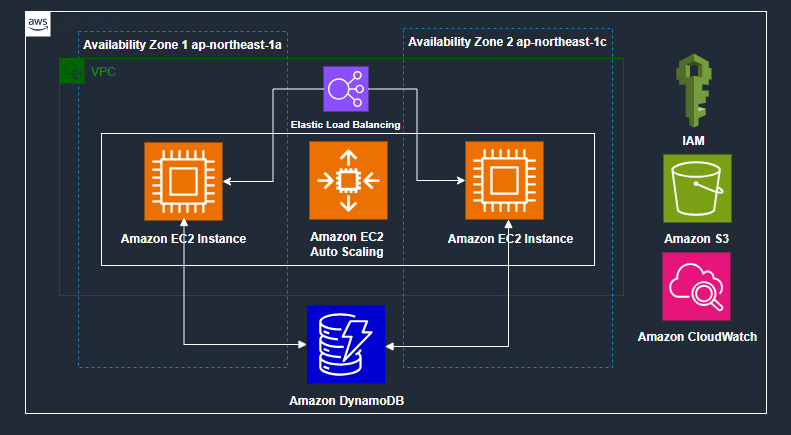
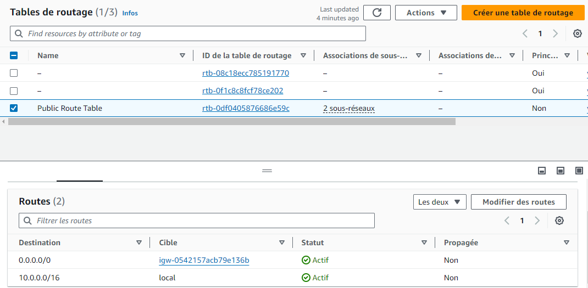
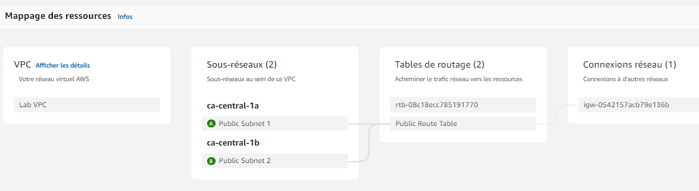
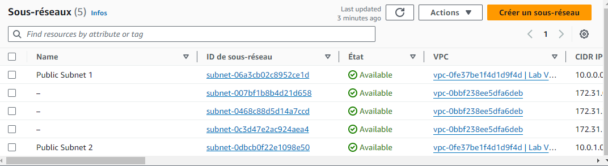
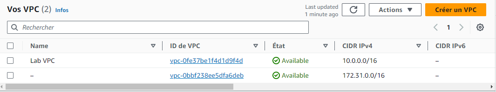
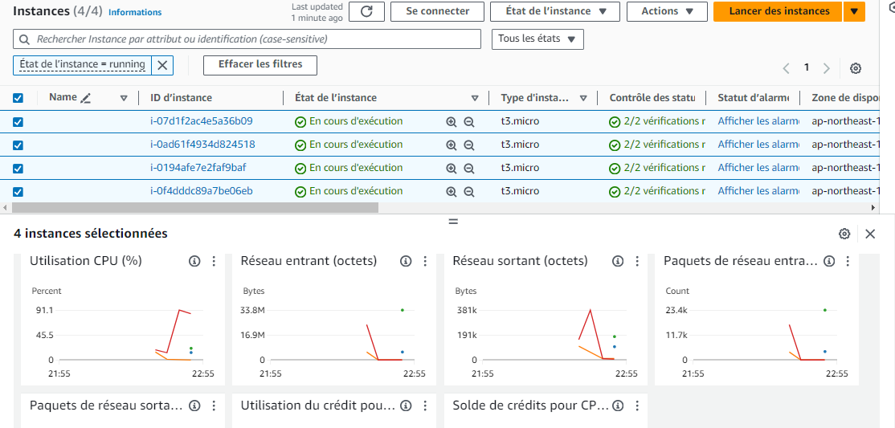
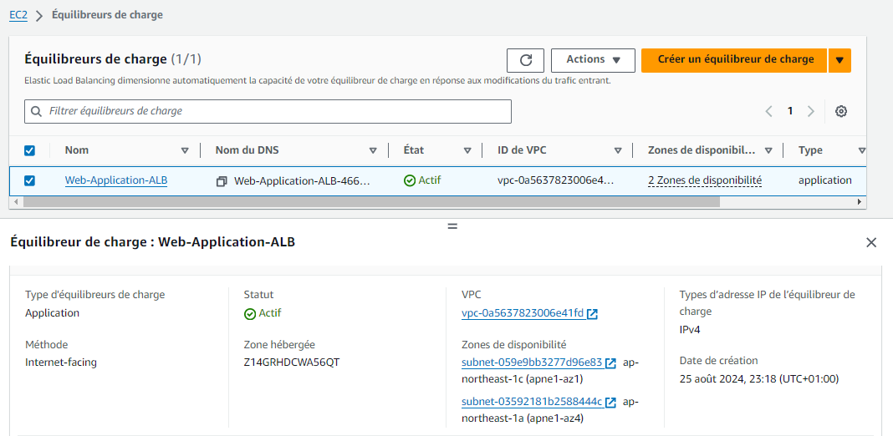
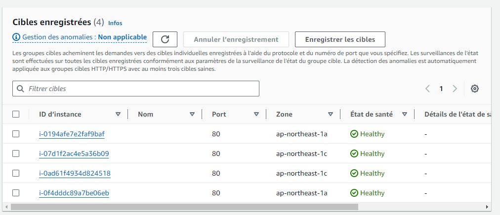
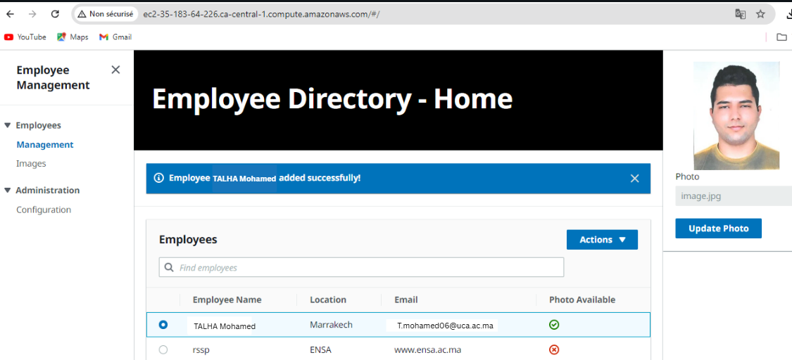
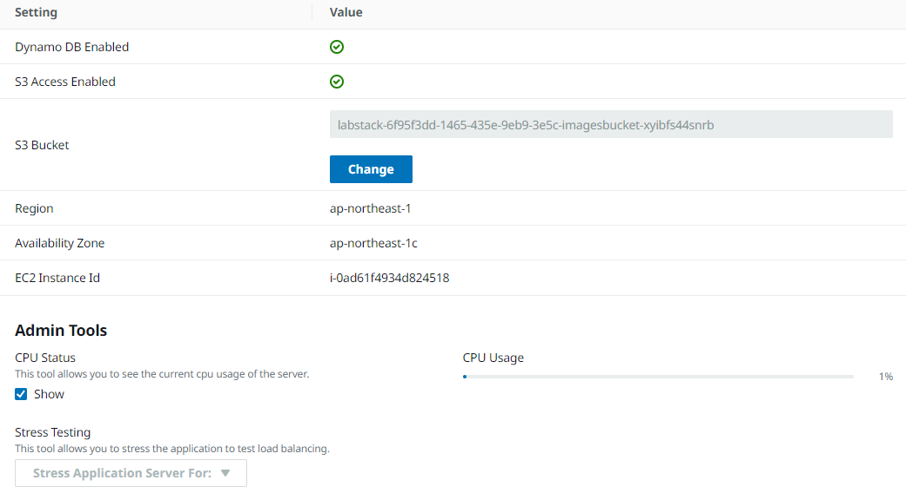

# 🚀 AWS Solution Architect Project

> Project carried out as part of the AWS Solution Architect certification. This project demonstrates the implementation of a complete cloud architecture, including VPC, EC2, Auto Scaling, Load Balancing, S3, DynamoDB, IAM, and CloudWatch.

---

## 🧩 Overall Architecture

Here is the overall architecture of the project:

1. **VPC (Virtual Private Cloud)**:
   - Two availability zones (`ca-central-1a` and `ca-central-1b`).
   - Two public subnets to ensure redundancy and high availability.

2. **Application Load Balancer (ALB)**:
   - Distributes the traffic between EC2 instances.
   - Ensures high availability in case of instance failure.

3. **EC2 Instances**:
   - Two EC2 instances deployed in different availability zones.
   - Managed by an Auto Scaling group to adjust based on demand.

4. **Auto Scaling Group**:
   - Automatically adds or removes EC2 instances based on load.

5. **Amazon DynamoDB**:
   - NoSQL table used for fast data storage and retrieval.

6. **Amazon S3**:
   - Object storage used to store files or static resources.

7. **IAM (Identity and Access Management)**:
   - Defines access policies for EC2 instances.

8. **Amazon CloudWatch**:
   - Monitors infrastructure metrics and logs.

---

### 2. Routing Table

**Description**: This image shows the routing table (`Public Route Table`) configuration associated with the public subnets. The following routes are defined:
- Destination: `0.0.0.0/0` → Target: Internet Gateway (`igw-0542157acb79e136b`)
- Destination: `10.0.0.0/16` → Target: Local

This ensures that EC2 instances can access the Internet and communicate with each other.

### 3. VPC Resource Mapping

**Description**: This image illustrates the mapping of VPC resources:
- **VPC**: `Lab VPC`
- **Subnets**:
  - `ca-central-1a`: `Public Subnet 1`
  - `ca-central-1b`: `Public Subnet 2`
- **Routing Tables**: `Public Route Table` is associated with both subnets.
- **Network Connections**: A connection to an Internet Gateway (`igw`) is configured.

### 4. Subnets List

**Description**: This image shows the list of created subnets:
- **Public Subnet 1**:
  - ID: `subnet-06a3cb02c8952ce1d`
  - CIDR: `10.0.0.0/24`
- **Public Subnet 2**:
  - ID: `subnet-0dbcb0f22e1098e50`
  - CIDR: `10.0.1.0/24`

Each subnet is available and associated with the `Lab VPC`.

### 5. VPC List

**Description**: This image shows the list of created VPCs:
- **Lab VPC**:
  - ID: `vpc-0fe37be1f4d1d9f4d`
  - IPv4 CIDR: `10.0.0.0/16`
- **Other VPC**:
  - ID: `vpc-0bbf238ee5dfa6deb`
  - IPv4 CIDR: `172.31.0.0/16`

The `Lab VPC` is used for this project.

### 6. EC2 Instances

**Description**: This image shows the running EC2 instances:
- **Number of instances**: 4 EC2 instances (`t3.micro`).
- **State**: All instances are in `Running` state.
- **Availability Zone**:
  - Two instances in `ap-northeast-1a`.
  - Two instances in `ap-northeast-1c`.

Displayed metrics:
- CPU usage (%)
- Network in/out (bytes)
- Network packets in/out

These instances are managed by an Auto Scaling group to ensure dynamic scalability.

### 7. Load Balancer

**Description**: This image shows the configuration of the Application Load Balancer (ALB):
- **Name**: `Web-Application-ALB`
- **Status**: Active
- **Type**: Application Load Balancer (ALB)
- **Scheme**: Internet-facing
- **VPC**: `vpc-0a5637823006e41fd`
- **Availability Zones**:
  - `subnet-059e9bb3277d96e83` (ap-northeast-1c)
  - `subnet-03592181b258844c` (ap-northeast-1a)

The ALB distributes traffic between EC2 instances across different availability zones, ensuring high availability and even traffic distribution.

### 8. Target Configuration

**Description**: This image shows the target configuration for the Application Load Balancer (ALB). Targets are typically EC2 instances or backend services the load balancer routes traffic to. The configuration includes:
- **Targets**: List of connected EC2 instances or resources
- **Status**: Status of each target (online, offline, etc.)
- **Weight**: Weight assigned to each target for traffic distribution

### 9. Employee Directory - Home

**Description**: This image shows the UI of the `Employee Directory` application:
- **Title**: `Employee Directory - Home`
- **Success Message**: A blue message indicates that the employee `'Talha Mohamed'` was added successfully.
- **Employee Table**:
  - Columns: `Employee Name`, `Location`, `Email`, `Photo Available`
  - Available Actions: An `Actions` option allows employee management (edit, delete, etc.)

This illustrates a web app interacting with a DynamoDB database to store and display employee information.

### 10. Application Settings

**Description**: This image shows the application settings:
- **Dynamo DB Enabled**: Enabled
- **S3 Access Enabled**: Enabled
- **S3 Bucket**: `labstack-6f95f3dd-1465-435e-9eb9-3e5c-imagesbucket-xyibfs44snrb`
- **Region**: `ap-northeast-1`
- **Availability Zone**: `ap-northeast-1c`
- **EC2 Instance ID**: `i-0ad61f4934d824518`
- **Admin Tools**:
  - **CPU Usage**: Displayed (1% currently)
  - **Stress Testing**: Option to simulate heavy load on the application

This shows that the app uses:
- DynamoDB as the NoSQL database
- S3 for storing employee photos
- A specific EC2 instance to host the application
- Admin tools to monitor CPU usage and perform stress tests

---

## 🛠️ Technologies Used

- **AWS Services**:
  - Amazon VPC
  - Amazon EC2
  - Auto Scaling
  - Application Load Balancer
  - Amazon S3
  - Amazon DynamoDB
  - IAM
  - Amazon CloudWatch
